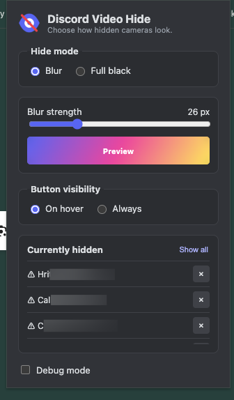

# Discord Video Hide

A small Chrome extension that lets you hide individual participant cameras in Discord voice calls. Hidden videos can be blurred or covered with a black overlay, while audio continues as normal.

## Capabilities

- Completely hide a participant’s video or blur it.
- Store hidden usernames locally so the chosen action is applied automatically when they appear again.
- Keep hidden-video settings in sync across multiple Discord tabs.

## Install

1. Download or clone this repository.
2. Open `chrome://extensions` in Chrome.
3. Turn on **Developer mode**.
4. Click **Load unpacked** and select this folder.
5. Open Discord in Chrome and join a voice call.

There is no build step or `npm install` required.

## Use

Hover over a participant’s camera tile and click the eye button to hide or show their video. Open the extension popup to choose blur or black mode, adjust blur strength, change button visibility, or show everyone again.

The extension works on Discord Web, including the regular, PTB, and Canary sites. It only changes what you see locally; it does not stop the video stream or save bandwidth. Settings are stored locally in Chrome.

## Limitations

- The extension only adds an overlay. It does not cut off or reduce the participant’s video traffic.
- It does not use AI to track scenes or actions and block them automatically. For now, videos must be hidden manually.

## Preview




## Tests

```sh
node --test tests/*.test.js
```
